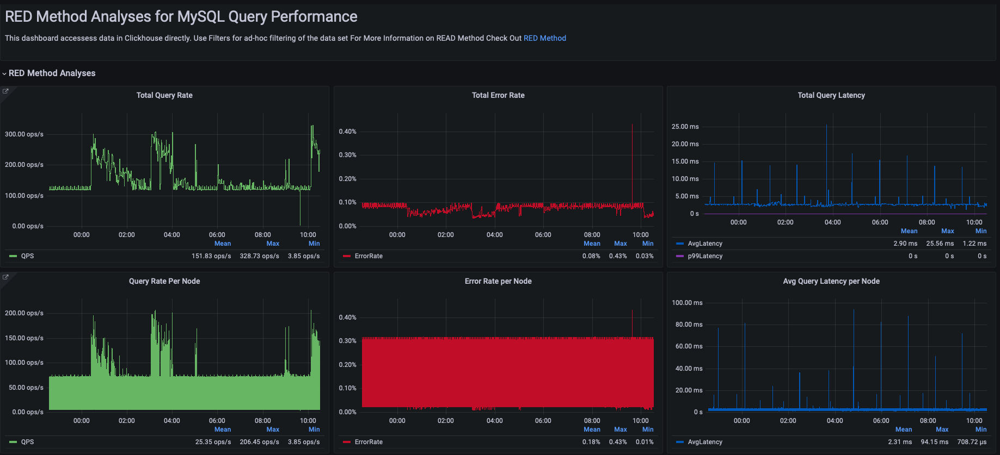

# MySQL RED Method Dashboard

This project provides an updated version of the MySQL performance analysis dashboard using the RED Method. The original concept was introduced by Percona in their blog post: [RED Method for MySQL Performance Analysis](https://www.percona.com/blog/red-method-for-mysql-performance-analyses/).


## 🚀 Overview

The RED Method focuses on tracking three key metrics:
- **Rate**: Number of requests per second.
- **Errors**: Number of failed requests.
- **Duration**: Time taken to respond to requests.

This updated dashboard helps you monitor these metrics to keep an eye on the performance of your MySQL database, leveraging the latest versions of PMM Server and Grafana.

## 📋 Changes and Updates

The original dashboard was outdated and incompatible with newer versions of PMM Server and Grafana due to:
- Changes in variable names.
- Style (cell colors, field filters, etc.) changes in panels.
- Transformation updates.

This project aims to adapt the original queries, variables, and styles to work seamlessly with modern versions, ensuring you can still benefit from this effective approach to database monitoring.

## 🛠 Installation

1. Clone the repository or download `12470_rev3.json` file:
   ```bash
   git clone https://github.com/xeonvs/mysql-red-method-dashboard.git
   ```
2. Import the dashboard JSON file into your Grafana instance.
3. Make sure your PMM Server is connected to your MySQL instances to start visualizing the metrics.

## ⚙️ Requirements

- **PMM Server** (the latest version recommended)
- **Grafana** (the latest version recommended)

## 🖥 Usage

After importing the dashboard, you will be able to monitor key RED metrics for your MySQL databases. These metrics help to quickly diagnose performance issues by focusing on high-level health indicators.

## 📂 Project Structure

- `dashboard/`
  - Contains the JSON file for the Grafana dashboard.

## 💬 Feedback

If you encounter any issues or have suggestions for improvements, feel free to open an issue on GitHub. Contributions are welcome!

## 🔗 Links

- Blog post: [RED Method for MySQL Performance Analysis](https://www.percona.com/blog/red-method-for-mysql-performance-analyses/)
- GitHub Project: [MySQL RED Method Dashboard](https://github.com/xeonvs/mysql-red-method-dashboard)

## 🏷 Tags

`#Grafana` `#PMM` `#MySQL` `#REDMethod` `#DatabaseMonitoring` `#Performance`

## 📜 License

This project is licensed under the MIT License. See the `LICENSE` file for more information.
